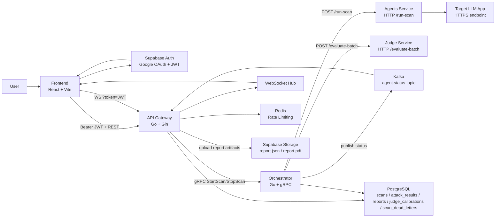
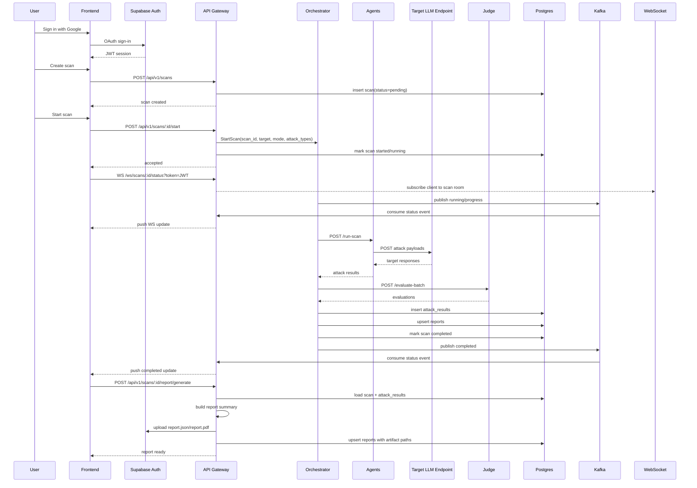
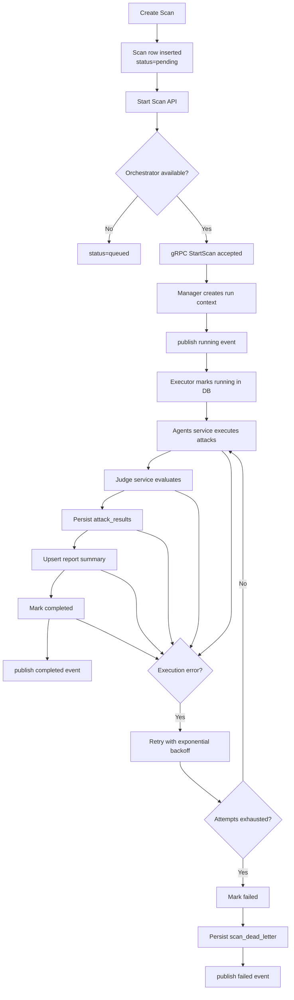
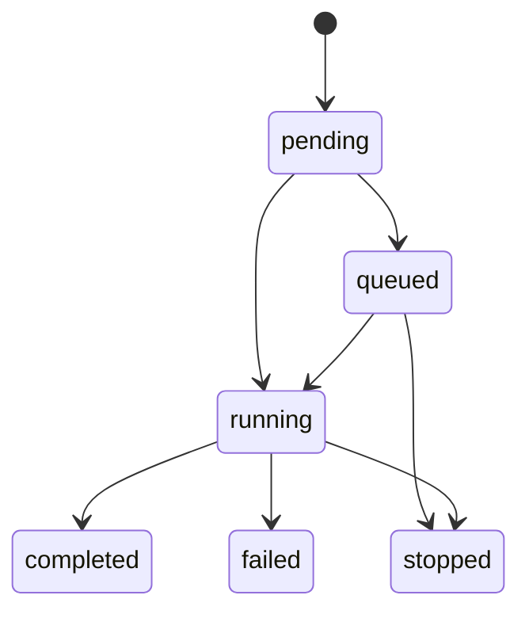
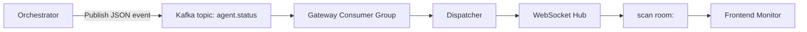
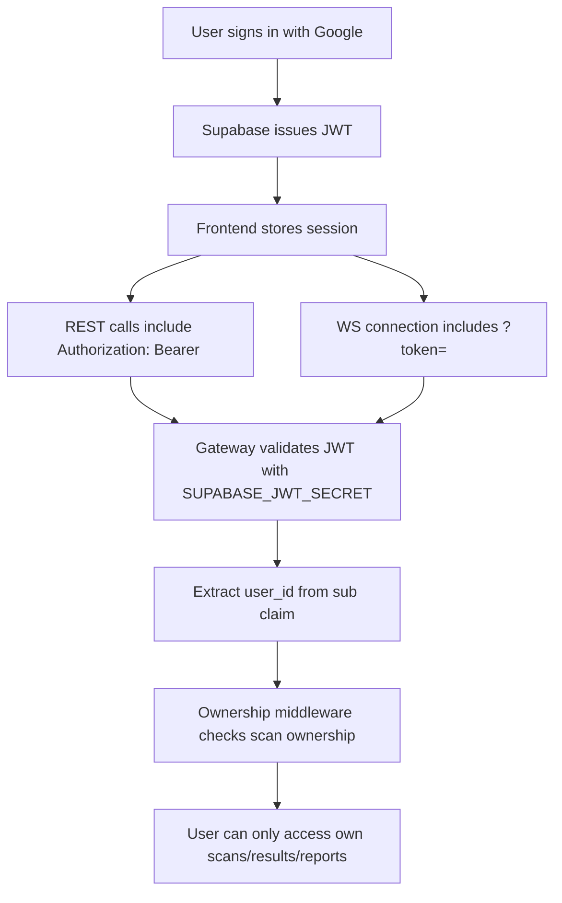
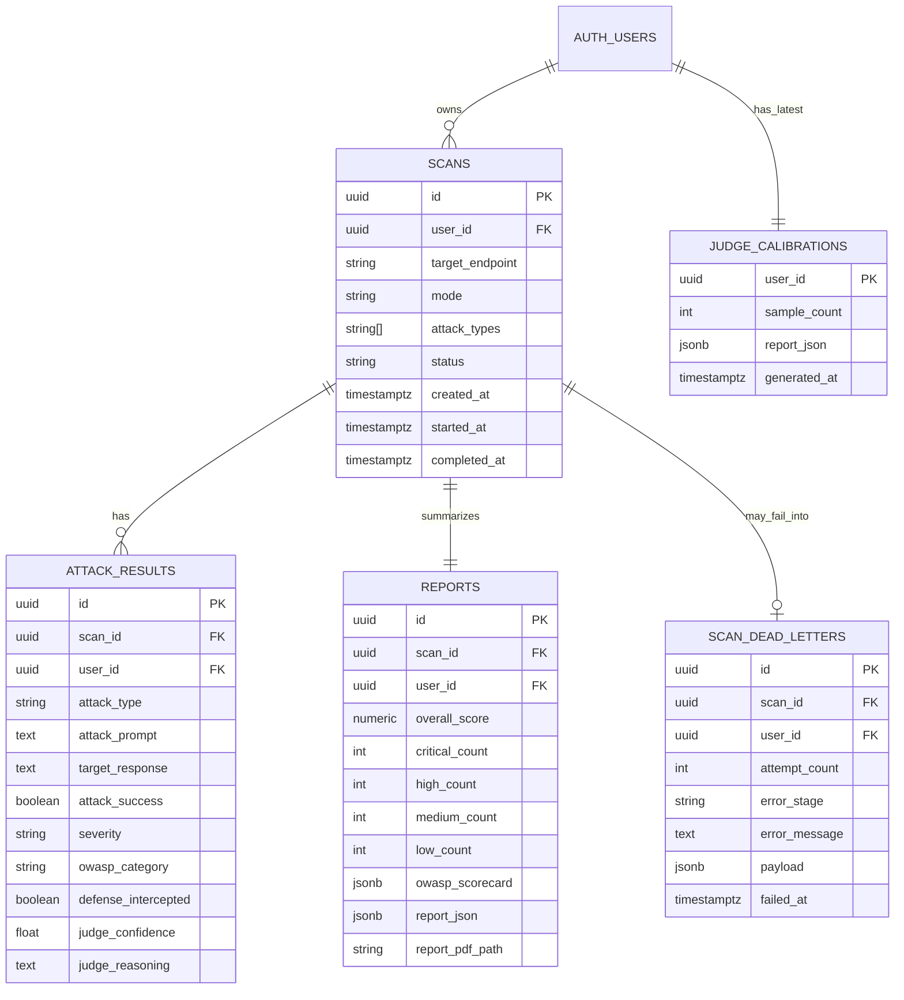
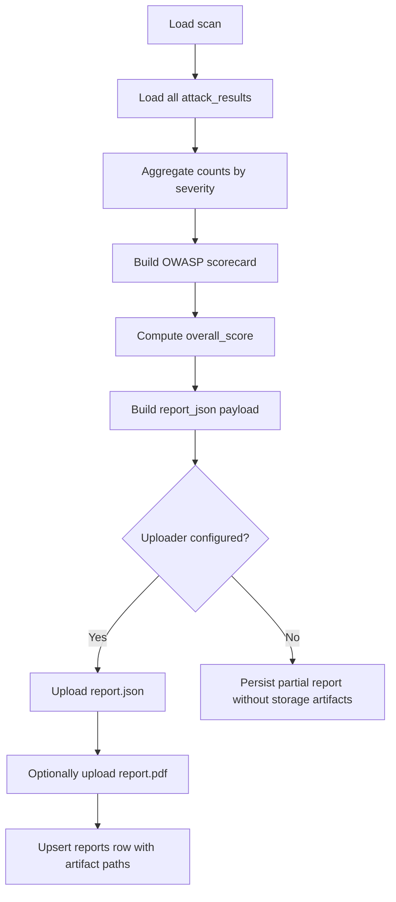
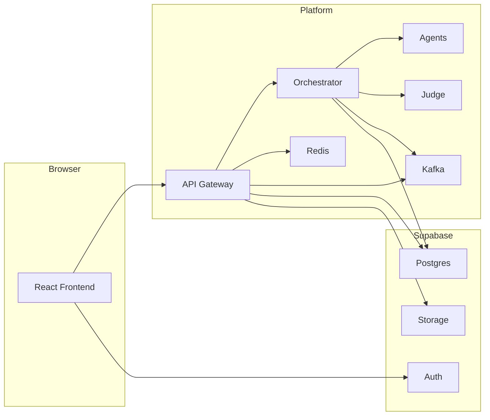
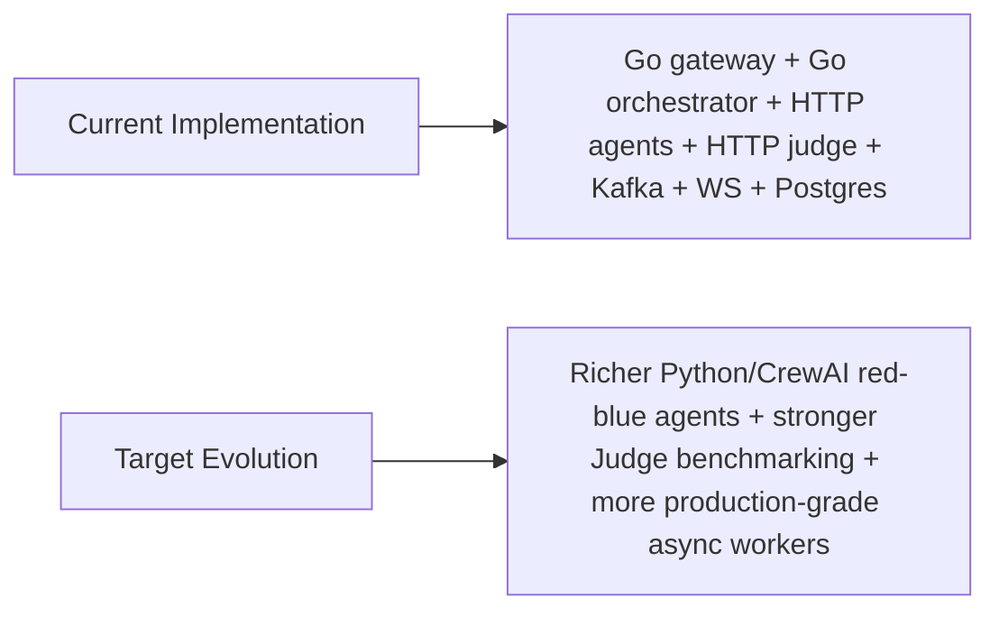

# AgentShield Architecture Interview Guide

This document is based on the current implementation in this repository, not only the PRD target vision.

## 1. Executive Summary

AgentShield is a multi-service LLM security scanning platform.

Its core job is:

1. accept a user-authenticated scan request,
2. orchestrate attack execution against a target LLM endpoint,
3. evaluate the responses with a Judge service,
4. persist structured findings and generated reports,
5. stream real-time scan status back to the dashboard.

The current implementation is centered on:

- `frontend`: React dashboard
- `api-gateway`: Go REST/WebSocket gateway
- `orchestrator`: Go gRPC orchestration service
- `agents`: HTTP attack execution service
- `judge`: HTTP evaluation service
- `PostgreSQL`: system-of-record for scans, attack results, reports, calibration, DLQ
- `Redis`: rate limiting
- `Kafka`: async event bus for scan status fan-out
- `Supabase`: Auth + Postgres hosting + object storage for report artifacts

Important interview framing:

- Current state: the platform already works end-to-end as a service-oriented scan pipeline.
- Planned evolution: richer Python/CrewAI agents, stronger Judge benchmarking, and more production-grade async workers.

## 2. High-Level Architecture

## 3. Component Responsibilities

### Frontend

- authenticates users with Supabase
- stores session and access token
- creates scans and starts/stops them
- fetches scan list, results, reports, dead letters, and Judge calibration report
- subscribes to real-time scan status over WebSocket

Primary pages:

- `Dashboard`
- `Create Scan`
- `Scan Monitoring`
- `Report Compare`
- `Judge Calibration`
- `Settings`

### API Gateway

The API gateway is the system boundary for clients.

It is responsible for:

- JWT validation
- ownership enforcement
- request validation
- REST API exposure
- report generation endpoints
- WebSocket endpoint for live scan status
- Kafka consumer wiring for event fan-out
- persistence repositories
- rate limiting with Redis
- orchestrator integration over gRPC

### Orchestrator

The orchestrator is the execution coordinator.

It is responsible for:

- accepting `StartScan` and `StopScan` over gRPC
- maintaining in-memory scan execution state and cancellation context
- calling downstream services in order
- updating progress milestones
- retrying failed executions with exponential backoff
- writing dead-letter records after retry exhaustion
- publishing scan status events to Kafka

### Agents Service

The agents service generates attack prompts and executes attacks.

Current modes:

- `simulate`: deterministic simulated responses
- `target_http`: sends HTTP requests to the target endpoint

Current attack categories:

- `prompt_injection`
- `jailbreak`
- `data_leakage`
- `constraint_drift`

### Judge Service

The Judge service evaluates attack outcomes.

Current modes:

- `rule`: deterministic heuristic evaluator
- `openai_compat`: OpenAI-compatible `/chat/completions` judging

The Judge outputs:

- `severity`
- `owasp_category`
- `confidence`
- `reasoning`
- `defense_intercepted`

## 4. End-to-End Scan Sequence

## 5. Runtime Control Flow

## 6. State Machine

State meanings:

- `pending`: created but not started
- `queued`: accepted by API but orchestrator unavailable
- `running`: active execution
- `completed`: pipeline finished successfully
- `failed`: retries exhausted
- `stopped`: user-requested stop or terminal stop

## 7. Real-Time Eventing Design

Design rationale:

- Orchestrator does not push directly to browser clients.
- Kafka decouples execution from UI delivery.
- API Gateway remains the only browser-facing surface.
- WebSocket rooms are keyed by `scan_id`, so the frontend only receives relevant events.

## 8. Authentication and Authorization

Security boundaries:

- browser authenticates with Supabase, not with the gateway directly
- gateway validates Supabase-issued JWTs
- database tables enforce Row Level Security
- middleware also enforces per-user ownership at API layer

## 9. Persistence Model

Persistence strategy:

- `scans` is the lifecycle root aggregate
- `attack_results` stores per-attack evidence
- `reports` stores aggregated security posture and artifact metadata
- `scan_dead_letters` stores terminal failures for retry visibility
- `judge_calibrations` stores the latest per-user Judge quality report

## 10. Report Generation Design

Current report semantics:

- score is penalty-based from successful findings
- JSON report is the canonical structured artifact
- PDF is a simplified generated artifact
- object storage paths are stored in the `reports` table

## 11. Deployment Topology

Current local-development deployment:

- `agents`, `judge`, `orchestrator`, `redis`, `kafka`, and `api-gateway` run via Docker Compose
- database and auth are expected from Supabase
- frontend runs separately with Vite

## 12. Design Tradeoffs

### Why separate API Gateway and Orchestrator

- the API Gateway handles client-facing concerns: auth, REST, WebSocket, ownership, rate limiting
- the Orchestrator handles long-running execution concerns: retries, cancellation, sequencing, progress
- this separation keeps the external API layer simpler and makes the execution pipeline independently evolvable

### Why Kafka for status events

- decouples pipeline execution from UI connection management
- supports future additional consumers like analytics, notifications, or audit streams
- prevents the Orchestrator from becoming browser-aware

### Why Postgres as source of truth

- scans, results, reports, and DLQ entries need durable persistence
- relational ownership constraints fit the per-user security model
- JSONB is used where report payloads need flexible structure

### Why Redis only for rate limiting

- Redis is used as a fast operational control plane, not as system-of-record
- durable domain state remains in Postgres

### Why Supabase

- gives Auth, Postgres, RLS, and object storage in one managed stack
- reduces glue code for early-stage product development

## 13. Current vs Target Architecture

How to say this in an interview:

- "What is fully implemented is the service skeleton and the end-to-end control plane."
- "What is still evolving is the sophistication of the attack agents and the Judge intelligence layer."

That answer is accurate and technically honest.

## 14. Suggested Interview Talk Track

Use this order:

1. "AgentShield is a multi-service LLM security scanning platform."
2. "The user interacts only with the React dashboard and the Go API gateway."
3. "The gateway authenticates with Supabase JWT, persists scan metadata, and delegates execution over gRPC."
4. "The orchestrator runs the scan pipeline: call Agents, call Judge, persist findings, and publish progress."
5. "Kafka decouples execution events from UI delivery, and the gateway fans them out over WebSocket."
6. "Postgres is the source of truth, Redis is for rate limiting, and Supabase Storage holds the report artifacts."
7. "If execution fails, the orchestrator retries with backoff and persists a dead-letter record after exhaustion."
8. "The current platform is already end-to-end, while richer multi-agent intelligence is the next evolution."

## 15. Likely Interview Questions

### Why not let the frontend call the orchestrator directly?

Because the orchestrator is an internal execution service, not a trust boundary. Authentication, ownership, throttling, and client protocol stability belong in the API Gateway.

### Why use gRPC between gateway and orchestrator?

The interface is internal, latency-sensitive, and typed. gRPC is a good fit for service-to-service control calls like `StartScan`, `StopScan`, and status queries.

### Why not make everything synchronous?

Because scan execution is long-running and failure-prone. Decoupling execution, event streaming, and report generation makes the system more resilient and easier to observe.

### What happens if the orchestrator is down?

The gateway falls back to stub behavior and marks scans as `queued`, which preserves the user request and avoids hard failure at the API boundary.

### What makes this secure from a multi-tenant perspective?

Three layers:

- Supabase JWT authentication
- API ownership middleware
- Postgres Row Level Security

## 16. Source Pointers

- API gateway bootstrap: `api-gateway/cmd/server/main.go`
- scan lifecycle handler: `api-gateway/internal/handler/scan_handler.go`
- report generation: `api-gateway/internal/handler/report_generation_handler.go`
- WebSocket auth/upgrade: `api-gateway/internal/handler/ws_handler.go`
- Kafka dispatch: `api-gateway/internal/kafka/dispatcher.go`
- orchestrator server: `orchestrator/internal/orchestrator/server.go`
- orchestrator manager: `orchestrator/internal/orchestrator/manager.go`
- orchestrator executor: `orchestrator/internal/orchestrator/executor.go`
- agents service: `agents/internal/service/service.go`
- judge service: `judge/internal/service/service.go`
- scan domain/state machine: `api-gateway/internal/domain/scan.go`, `api-gateway/internal/domain/state_machine.go`
- DB schema: `api-gateway/migrations/001_create_scans.sql`, `004_create_attack_results.sql`, `005_create_reports.sql`, `008_create_judge_calibrations.sql`, `009_create_scan_dead_letters.sql`
